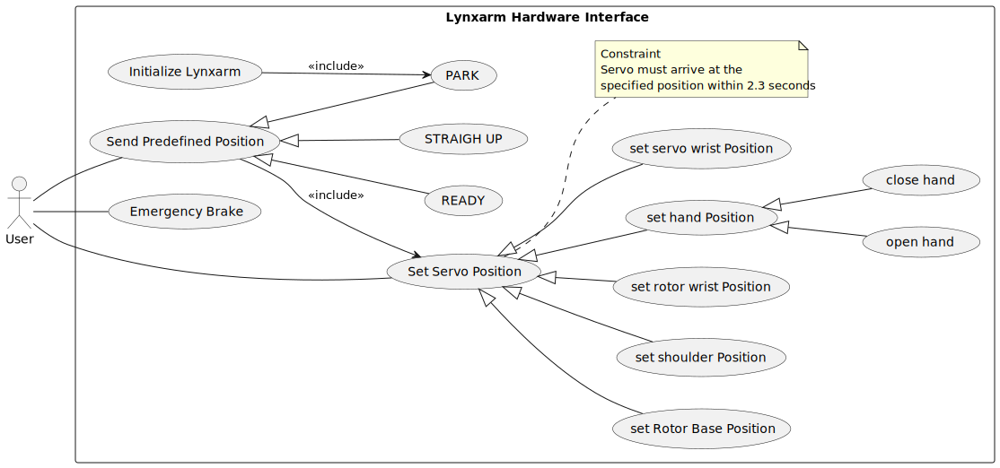
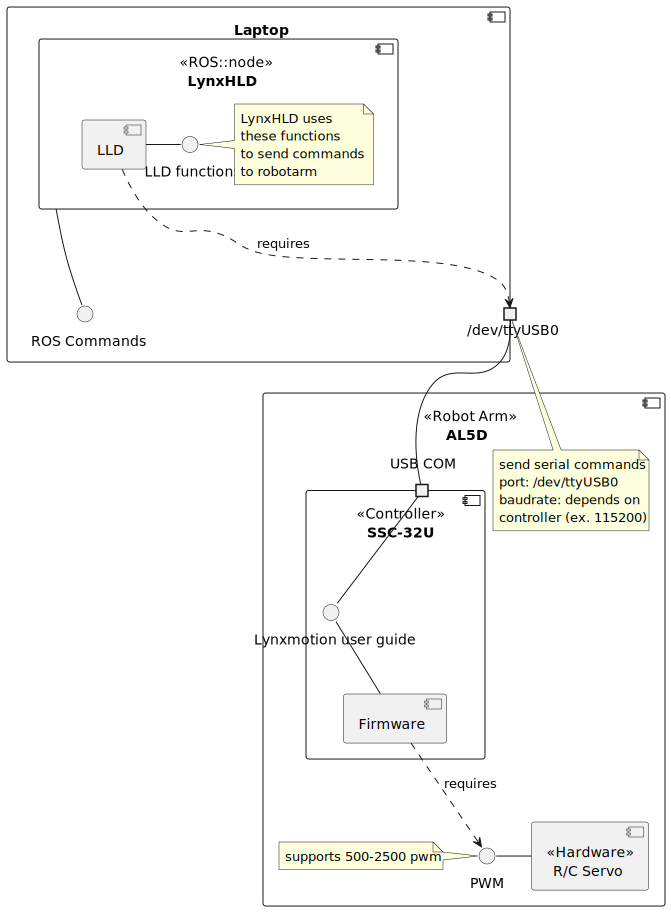
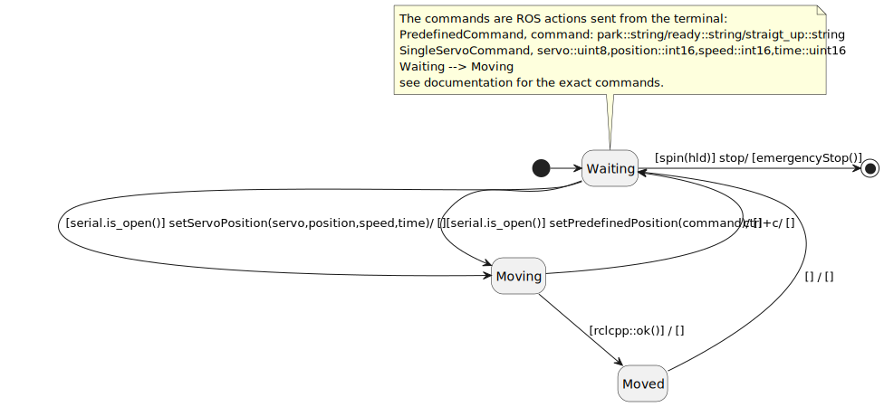
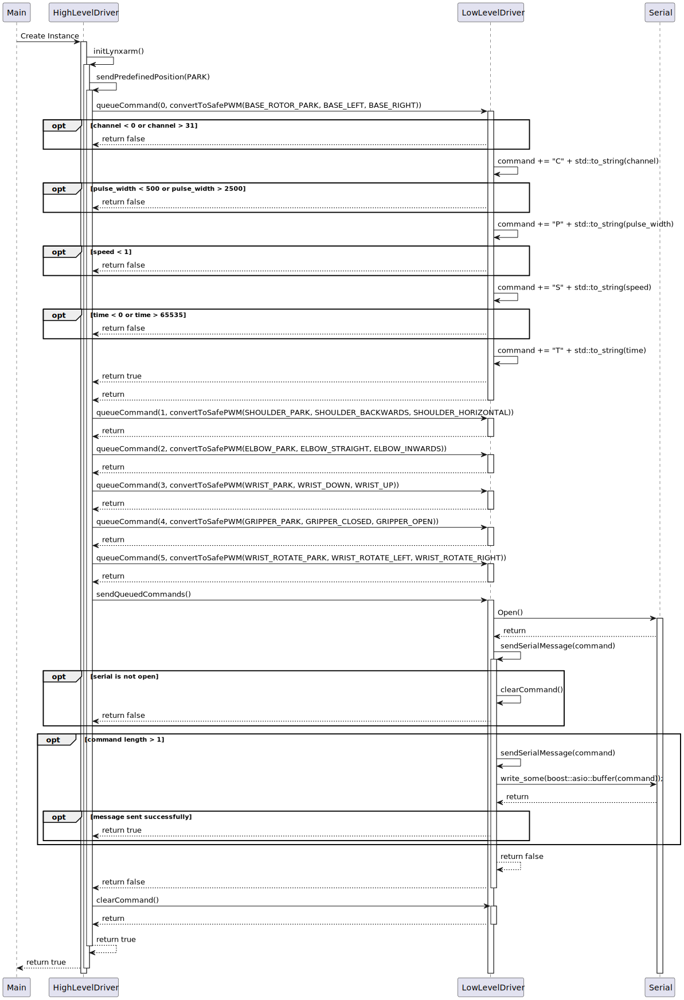
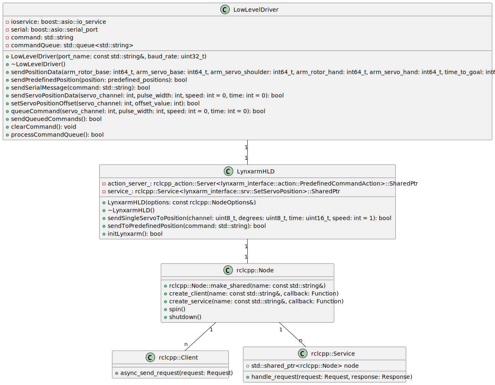
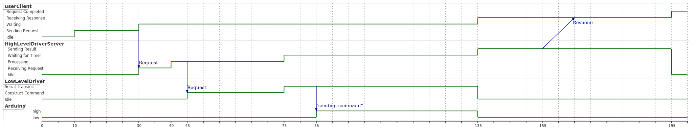

World beroepsproduct robotarm interface

# LynxMotion_Hardware_Interface
lynxmotion_ssc_32u Controller


# Requirements

Servo Control (SA01-SA04):
(implemented)* Develop ROS nodes to control each degree of freedom of the robotic arm using servo motors. Ensure the ability to move servos to specified positions and adjust movement speed as required.
(implemented)* Implement logic to account for differences in arm configurations, such as variations in servo orientations.

Predefined Positions (PO01-PO03):
(implemented)* Define predefined positions for the arm, such as Park, Ready, and Straight up. Develop ROS services or actions to move the arm to these positions upon request.


Safety Features (VE01-VE03):
(implemented)* Implement emergency stop functionality to halt arm movement immediately in case of emergencies.
(implemented)* Enforce limits on servo motion to ensure it stays within safe ranges.
(implemented)* Ensure the arm initializes safely upon startup, moving to a predefined safe position.

Operational Information (INF01-INF03):
(implemented)* Provide operational information via ROS logging mechanisms at appropriate log levels (INFO, DEBUG, WARNING). Include state information, event notifications, and warnings for delayed actions.

Queueing of Commands (EX01):
(not implemented)*  Implement a command queue to manage multiple commands, allowing for queuing, dequeuing, and clearing of commands. Ensure the queue is emptied during emergency stops.

Documentation (SY01-SY04):
* Document the system design, including use cases, subsystem decomposition, component diagrams, system behavior using state diagrams, and interfaces.
(implemented)* Provide detailed documentation for the ROS nodes, services, and actions developed, including API documentation generated with Doxygen.

System Description (SY01-SY04):
* Describe the system architecture, interfaces, and ports using component diagrams.
* Use state diagrams to illustrate the system behavior in different states and transitions.

Demonstration (DE01-DE02):
* Develop a demo application that showcases the functionality of the software interface.
(implemented)* Demonstrate the ability to initialize the arm, move it to predefined positions, execute sequential movements, trigger emergency stops, and return to a safe position.
* Clearly present and validate the achieved Quality of Service (QoS) during the demonstration.

# UML Diagrams for world_robotarm_interface

## Use Case Diagram


### Use Case: Set Servo Position

    Use Case ID: UC001
    Use Case Name: Set Servo Position
    Initiator: User
    Actors: User, Lynxarm System
    Preconditions:
       * The Lynxarm system is powered on and initialized.
       * The Lynxarm system is in a PARK state to move the servo.
    Postconditions:
       * The servo is set to the desired position.
       * The system gives feedbakc of the action for audit purposes.
    Trigger: The user wishes to change the position of a specific servo in the Lynxarm system.

Main Success Scenario:

   * The user accesses the Lynxarm control interface.
   * The user sends the "Set Servo Position" action with specification of servo ID and position. Optionally the user can specify the speed or time of the moving action.
   * The system recieves the request.
   * The system check if the specified parameters are valid.
   * The system generates a command based on the values.
   * The system send the command over the serial communication
   * The system start a timer to check when the command has been processed.
   * The servo moves to the specified position.
   * The system sends feedback to the user indicating the command has been processed succesfully.

Extensions:

   * 3a. The specified servo does not exist or is not operational:
   *     3a1. The system informs the user of the invalid selection.
   *     3a2. The system returns the user to step 2.
   * 4a. The system converts degrees into a PWM in user specified degrees as a value.
   * 6a. The user can cancel the moving action:
   *     6a1. The user can cancel by executing the emergency stop command.
   *     6a1. The user can cancel by terminating the program.            
   *     7a2. The system returns the user to step 2.


## Component Diagram
Structure shows how the high level driver and low lever driver are connected with the robot arm.

ROS Commands:
This is the interface that allows the user to move the robot arm.

Demo: 
There is a script that uses the ROS commands called Demo.sh.



## Protocol State Diagram
The interactions the user can do to change the states of the software.
Commands: 
```
To start the server: ros2 run lynxarm_srvcli server 
To start client (send servo position): ros2 run lynxarm_srvcli client <servo> <position> <speed> <time>
To start client (emergency brake): ros2 run lynxarm_srvcli client
To move to predefined postion (PARK,READY,STRAIGHT_UP): 
ros2 action send_goal /lynxcommand lynxarm_interface/action/PredefinedCommandAction "{command: <string, park/ready/straight_up>}"
To move a single servo:
ros2 action send_goal /lynxcommandservo lynxarm_interface/action/SingleServoCommand "{servo: <uint8>, position: <int16>, speed: <optional, int16>, time: <uint16>}"
```



## Sequence Diagram
Shows the initialization flow of the software.



<!-- ## System Architecture
For the lowleveldriver
 -->

## Timing Diagram
Timing diagram for sending a command request from client that moves the robot arm when the server is waiting for requests.



## Other
More diagrams is seen in the folder UML.

# Doxygen 
Doxygen is available and can be accessed in the DoxyGen folder


